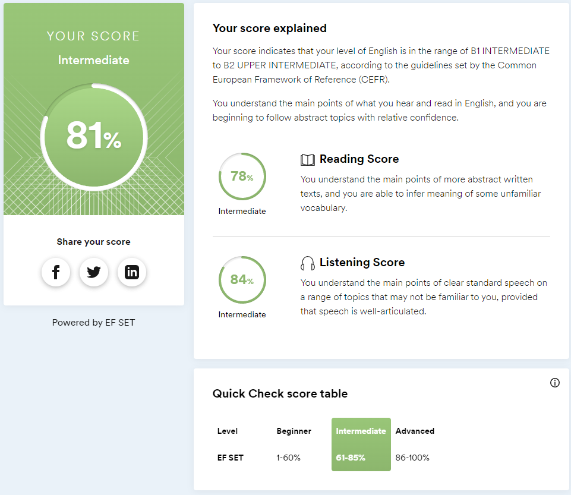

# Mark Gorsharik

**_Beginning frontend developer_**

---

### Contact information:

- _Phone:_+375336862774
- _E-mail:_ markgorsharik@gmail.com
- _Telegram:_ @Marchezko
- [GitHub](https://github.com/jdays2)

---

## Who is Mark?

Well, hello there, as you may have realized, my name is Mark. I am 22 years old, like everyone else here, I am a beginner frontend developer. At least I try to become one. My way in this area began almost a year ago. Slowly in the beginning and rapidly by the last days I was learning, trying to do some projects for myself. All my life I was looking for what I want to do, where I want to work. Everywhere I went I felt out of place, I couldn't find inner peace and joy in what I was doing. No extra pay or promotion could satisfy me, because I was unhappy at heart. My life changed when I started learning how to frontend. I work at my day job, which gives me a living wage, but I spend all my free time with frontend. I'm not some genius developer who can grasp everything in the blink of an eye. Yes, it can be difficult. But I never stop, because the reward for diligence and solving complexities gives me something I've been missing for so long. Makes me finally feel happy and in my place. I'm willing to do anything to tie my life to this field.

---

### My skills:

- HTML/CSS(tried SSAS)
- JS
- TS(beginner)
- REACT/REDUX-toolkit
- Git/Github/Vercel

---

### CodeWars example:

[My first task on 6kata](https://www.codewars.com/kata/5266876b8f4bf2da9b000362/)
**Short Description:** You probably know the "like" system from Facebook and other pages. People can "like" blog posts, pictures or other items. We want to create the text that should be displayed next to such an item.

```
function likes(names) {
  if (!names.length) {
    return "no one likes this";
  } else if (names.length === 1) {
    return `${names[0]} likes this`;
  } else if (names.length === 2) {
    return `${names[0]} and ${names[1]} like this`;
  } else if (names.length === 3) {
    return `${names[0]}, ${names[1]} and ${names[2]} like this`;
  } else if (names.length >= 3) {
    return `${names[0]}, ${names[1]} and ${names.length - 2} others like this`;
  }
}
```

---

### My projects:

_To say that I have a lot of experience in development would be a mistake, but I constantly tried to do some small projects to consolidate the result and continue to do it, to sharpen my skills. I am self-taught. All the information I get from online sources, small courses and help from my mentor. RSS was my first big experience in development and comprehensive study._

- [vercel](https://tic-tac-toe-puce-five.vercel.app/) [github](https://github.com/jdays2/TicTacToe) (The tic-tac-toe game. Implemented all on REACT, using REDUX-Toolkit, axios, and TypeScript. Will be finalized and refactored. This is not the final version )
- [vercel](https://react-pizza-theta-blue.vercel.app/) [github](https://github.com/jdays2/ReactPizza)(Project obtained by taking a course on youtube on React. I can't call it 100% my own. )
- [vercel](https://time-tracking-flax.vercel.app/) [github](https://github.com/jdays2/time-tracking)(A small project with adaptive layout, loaded with data from the backend. Just a no-brainer. )

---

### My English:

I have always liked English, as well as the other languages. I owe most of my knowledge to my fascination with English-speaking popular culture. I used to watch everything in subtitles, from movies to YouTube videos. The articles and news are all in the same English. Pronunciation is not the cleanest, but I understand just fine for my level.

**Quick test results from www.efset.org:**



---
